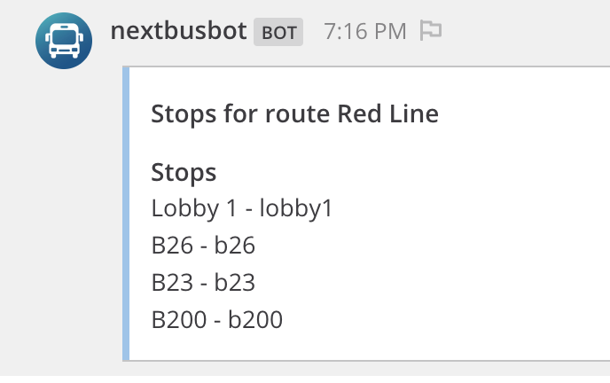
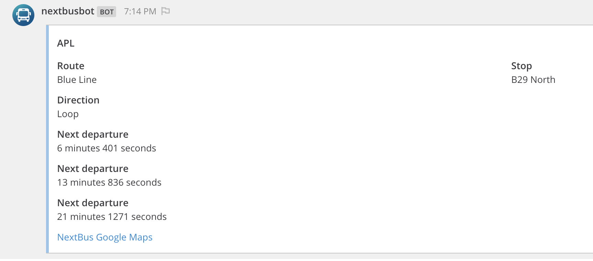

# NextBus Plugin 

This bot Plugin will help you to check when the next bus will be available to you to catch :). Do not miss any bus anymore.

The nextBus api is a fork from https://github.com/jcomo/go-nextbus and will have some modifications to adapt the use cases for this plugins.

**Supported Mattermost Server Versions: 5.10+** because it uses the bot acounts.

## Installation

1. Go to the [releases page of this GitHub repository](https://github.com/cpanato/mattermost-plugin-nextbus/releases) and download the latest release for your Mattermost server.
2. Upload this file in the Mattermost **System Console > Plugins > Management** page to install the plugin, and enable it. To learn more about how to upload a plugin, [see the documentation](https://docs.mattermost.com/administration/plugins.html#plugin-uploads).
3. Start using your plugin and have fun.

## Plugin in Action

# 
# 
# 
